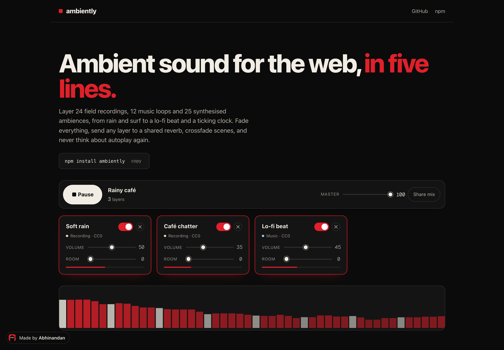

# Ambiently

[](https://www.npmjs.com/package/ambiently) [](https://github.com/abhinandansharma/ambiently/actions) 

A tiny ambient sound engine for the web. Layer looping tracks and synthesised
ambiences, fade everything with gain ramps so nothing clicks, crossfade between
scenes, and stop fighting autoplay policies. Zero dependencies. Works anywhere the
Web Audio API does, with first-class React and Next.js bindings.

**Demo:** https://abhinandansharma.github.io/ambiently/ — 25 scenes and 47 sounds (24 field recordings, 2 music loops, 21 synths), with an "All sounds" catalogue where you can add any layer to the mix and read off the code that reproduces it.



```bash
npm install ambiently
```

## Why

Background sound on the web is usually one `<audio loop>` tag that pops at the
loop point, starts at full volume, and gets blocked by the browser. Ambiently is a
small mixer instead:

- **Layers.** Rain under a lo-fi track under a fireplace, each with its own volume.
- **Seamless loops.** Decoded buffers on `AudioBufferSourceNode`, so loops are gapless.
- **Fades everywhere.** Play, pause, volume changes and crossfades are all gain ramps.
- **Synthesised ambiences.** Twenty-one of them, from `rain`, `wind`, `fire` and `ocean` to
  `crickets`, `birds`, `clock`, `vinyl` and `heartbeat`, all generated procedurally. No audio
  files to host or license.
- **Autoplay handled.** The context is created lazily and resumed on the first user
  gesture. Anything you asked to play starts the moment the browser allows it.
- **SSR safe.** Nothing touches `window` until you play.

## Quick start

```ts
import { AmbientlyEngine } from 'ambiently';

const ambient = new AmbientlyEngine([
  { id: 'rain', synth: 'rain', volume: 0.4 },
  { id: 'fire', synth: 'fire', volume: 0.3 },
  { id: 'lofi', src: '/sounds/lofi.mp3', volume: 0.6 },
]);

button.addEventListener('click', () => ambient.toggle());
slider.addEventListener('input', (e) => ambient.setVolume('rain', e.target.valueAsNumber));
```

That is a working three-layer soundscape. Calling `play()` or `toggle()` inside a
click handler unlocks audio. If you call it earlier, the engine waits for the first
pointer, key or touch event and then starts.

## One-shot hits

Percussion and short melodic hits, synthesised on demand, for instruments, games and
UI sounds. Twenty voices: `kick`, `sub`, `tom`, `snare`, `rim`, `clap`, `hat`, `shaker`,
`wood`, `pluck`, `bell`, `chime`, `stab`, `blip`, `zap`, `laser`, `sweep`, `riser`,
`noise`, `drop`.

```ts
import { createHits } from 'ambiently';

const ctx = new AudioContext();
const hits = createHits(ctx);

window.addEventListener('keydown', (e) => {
  const length = hits.play('kick', { velocity: 0.9, pitch: -2 }); // seconds, handy for animation
});

// schedule on the audio clock for tight loops
hits.play('hat', { when: ctx.currentTime + 0.25 });
```

`createHits(ctx, destination?)` returns `{ play, duration, output }`. Everything is built
from oscillators, filters and the same noise buffers the ambiences use, so there is
nothing to download. This is what powers [Patatap](https://abhinandansharma.github.io/patatap/).

## React and Next.js

```tsx
'use client';
import { useAmbiently } from 'ambiently/react';

const layers = [
  { id: 'rain', synth: 'rain', volume: 0.4 },
  { id: 'lofi', src: '/sounds/lofi.mp3', volume: 0.6 },
];

export function SoundToggle() {
  const { playing, toggle, layers: state, setVolume } = useAmbiently(layers);
  return (
    <div>
      <button onClick={() => toggle()}>{playing ? 'Pause' : 'Play'} ambience</button>
      {state.map((l) => (
        <label key={l.id}>
          {l.id}
          <input type="range" min={0} max={1} step={0.01} value={l.volume}
                 onChange={(e) => setVolume(l.id, e.target.valueAsNumber)} />
        </label>
      ))}
    </div>
  );
}
```

Or drop in the headless component and let it run:

```tsx
import { Ambiently } from 'ambiently/react';

<Ambiently layers={[{ id: 'wind', synth: 'wind', volume: 0.3 }]} />
```

The hook keeps the engine in sync with the `layers` you pass, so swapping the
array crossfades to the new scene. Everything is created inside effects, so it is
safe to render on the server.

## API

### `new AmbientlyEngine(layers?, options?)`

| Option | Default | What it does |
| --- | --- | --- |
| `masterVolume` | `1` | Master bus level, 0 to 1 |
| `fadeMs` | `800` | Default fade for every transition |
| `context` | created lazily | Bring your own `AudioContext` |
| `unlockOn` | `['pointerdown','keydown','touchstart']` | Gesture events that resume the context. `false` to manage it yourself |

### Layers

```ts
interface LayerConfig {
  id: string;            // required, unique
  src?: string;          // audio file URL
  synth?: SynthPreset;   // one of the twenty-one presets below
  volume?: number;       // 0 to 1, default 0.5
  loop?: boolean;        // default true (files only; synths always loop)
  fadeMs?: number;       // per-layer fade override
  playbackRate?: number; // files only
}
```

### Methods

| Method | Notes |
| --- | --- |
| `play(id?)` | Start one layer or all. Resolves once running |
| `pause(id?, fadeMs?)` | Fade out, then stop the sources |
| `toggle(id?)` | |
| `stop()` | Same as `pause()` |
| `add(layer)` | Add or update a layer. Starts it if the engine is playing |
| `remove(id, fadeMs?)` | Fade out and forget |
| `crossfadeTo(layers, fadeMs?)` | Replace the scene: fade out what is gone, fade in what is new |
| `setVolume(id, v, fadeMs?)` | |
| `setMasterVolume(v, fadeMs?)` | |
| `mute()` / `unmute()` | Master bus |
| `getState()` | `{ playing, unlocked, masterVolume, muted, layers[] }` |
| `on(event, cb)` | Events: `play`, `pause`, `volume`, `layers`, `unlock`, `load`, `error`. Returns an unsubscribe function |
| `getAnalyser(fftSize?)` | An `AnalyserNode` on the master bus, for visualisers |
| `unlock()` | Resume the context now, from inside a gesture handler |
| `destroy()` | Stop everything and close the context |

### Synth presets

Twenty-one, built from three cached noise buffers plus oscillators, filters, LFOs and a
few scheduled events. `SYNTH_PRESETS` exports the list.

| Preset | What it is |
| --- | --- |
| `rain` | Pink noise through a high-pass with a slow swell, plus a band-passed sheen |
| `wind` | Brown noise through a band-pass whose centre wanders, with gusts |
| `fire` | Low-passed brown rumble plus randomly gated crackles |
| `ocean` | Low-passed swells that breathe, with foam cresting on top |
| `stream` | A fluttering band-pass babble, sparkle above, body below |
| `thunder` | A constant far rumble, with rolls every five to twenty seconds |
| `crickets` | Two high sines pulsed at about 40 Hz, chirping at their own tempo |
| `birds` | Sine-sweep phrases of one to four notes, from birds near and far |
| `frogs` | Pulsed square-wave croaks from a couple of frogs |
| `snow` | A blizzard: harder gusts with more top end and a whistle |
| `city` | A traffic rumble bed with cars passing and sweeping up in pitch |
| `fan` | Motor hum with harmonics and air chopped by the blades |
| `clock` | A filtered click every second, alternating tick and tock |
| `vinyl` | Surface hiss, sparse crackles and a 33 rpm wow |
| `heartbeat` | Lub-dub at sixty a minute, a low sine dropping in pitch |
| `hum` | A 50 Hz tone with harmonics, gently wobbling |
| `drone` | Detuned saws an octave apart under a breathing low-pass, with a sub |
| `space` | Hull rumble, a tone that drifts over minutes, a faint whistle above |
| `white`, `pink`, `brown` | The noise itself |

They cost nothing to ship and loop forever without seams.

## Development

```bash
npm install
npm test            # vitest, with a Web Audio stand-in
npm run build       # tsup -> dist/ (esm, cjs, d.ts)
npm run demo        # Next.js demo at http://localhost:3000/ambiently
```

The demo in `demo/` imports the library from `src/` directly, so changes show up
without a build. It is exported statically and published to GitHub Pages by the
workflow in `.github/workflows/`.

The demo's twenty-four field recordings (rain, heavy rain, thunder, wind, ocean, a harbour,
the deep sea, a stream, a waterfall, forest, rainforest, meadow, crickets, frogs, fireplace,
café, market, keyboard, air conditioner, a purring cat, wind chimes, city, train, airplane)
are CC0 recordings from Freesound found through Openverse, cut to 30 second seamless
loops and encoded as AAC. Sources are listed in `demo/public/sounds/CREDITS.json`
and on the demo page. The library itself ships no audio.

## License

MIT © Abhinandan Sharma
